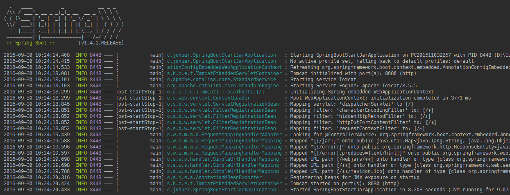

SpringBoot Crete Jar

> springboot搭建以及打包jar

## 创建步骤


## 新建controller
```java
@Controller
public class JarExample {

    @RequestMapping("jar")
    @ResponseBody
    public Map<String, Object> jar() {
        Map<String, Object> map = new HashMap<String, Object>();
        map.put("jar", "This is a jar Example");
        return map;
    }
}
```

## 运行main

```java
@SpringBootApplication
public class SpringBootStartJarApplication {

	public static void main(String[] args) {
		SpringApplication.run(SpringBootStartJarApplication.class, args);
	}
}
```




## 打包jar

修改build.gradle
```gradle
jar {
	baseName = 'SpringBootStartJar'
	version = '0.0.1-SNAPSHOT'
	manifest {
		attributes 'Main-Class': 'com.johuer.SpringBootStartJarApplication'
	}
}
```

运行build


## 执行jar

cd 到jar包目录，执行`java -jar xxxx.jar`(xxxx.jar为打包好的jar)


## 结果

`http://localhost:8080/jar`


